# Desafío Wireshark 
Actividad) Desafío Wireshark
Análisis con Wireshark
Introducción a Wireshark
Actividad) Desafío Wireshark
Completo

 

En esta actividad, pondrás a prueba tus nuevos conocimientos de Wireshark analizando dos PCAP, cuya dificultad aumenta. Podrás completar ambos desafíos utilizando los conocimientos adquiridos en las lecciones anteriores del curso.

Descargo de responsabilidad

Tenga en cuenta que los archivos incluidos en el material "Análisis con Wireshark" tienen fines educativos y de práctica. Estos archivos son propiedad del equipo de Security Blue y han sido revisados exhaustivamente para garantizar su seguridad.

Alertas de seguridad del navegador:

Es posible que Chrome u otros navegadores web muestren advertencias o indicadores que indiquen que los archivos pueden ser maliciosos. Esta es una medida de precaución común que implementan los navegadores debido a sus protocolos de seguridad integrados. Estas alertas suelen activarse por la naturaleza del archivo, no por su contenido.
Garantía de seguridad:

Le aseguramos que estos archivos no contienen malware ni contenido dañino. Han sido creados y verificados específicamente por el equipo de Security Blue para su uso instructivo en formación en ciberseguridad.
Instrucciones de uso:

Si le preocupa ejecutar estos archivos en su sistema host, puede considerar utilizar una máquina virtual o un entorno aislado para mayor seguridad.
Si tiene más preguntas o aclaraciones, consulte nuestros recursos de soporte o comuníquese con nuestro equipo de soporte a través de studentsupport@securityblue.team.
Pruebe un navegador diferente: recomendamos descargar el archivo de actividad utilizando un navegador alternativo como Firefox.
Software antivirus: si tiene instalado Avast, le sugerimos desinstalarlo temporalmente para ver si resuelve el problema de descarga, en caso de que surja.
Gracias por su comprensión y cooperación.

Equipo Azul de Seguridad

 

Los archivos no pueden redistribuirse sin el consentimiento expreso del Equipo de Seguridad Azul. Todos los derechos de propiedad intelectual nos pertenecen.

 

 

 

Preguntas sobre la actividad de Wireshark
 

PCAP 1
¿Qué protocolo se utilizó en el puerto 3942?
¿Cuál es la dirección IP del host al que se le hizo ping dos veces?
¿Cuántos paquetes de respuesta de consulta DNS fueron capturados?
¿Cuál es la dirección IP del host que envió la mayor cantidad de bytes?
 

PCAP 2
¿Cuál es la contraseña de WebAdmin?
¿Cuál es el número de versión del servidor FTP del atacante?
¿Qué puerto se utilizó para obtener acceso al host Windows de la víctima?
¿Cuál es el nombre de un archivo confidencial en el host de Windows?
¿Cuál es el nombre del archivo de registro que se creó a las 4:51 a. m. en el host de Windows?
---

## PCAP 1 – Pregunta 1  
**Protocolo en puerto 3942:** SSDP  
[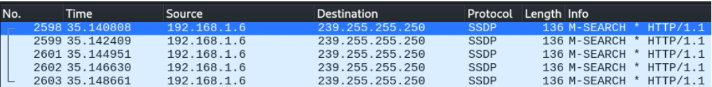](https://raw.githubusercontent.com/nicosotomayor/Wireshark-Challenge/main/Imagenes/A1.jpg)

---

## PCAP 1 – Pregunta 2  
**Host ping‑eado dos veces:** 8.8.4.4  
[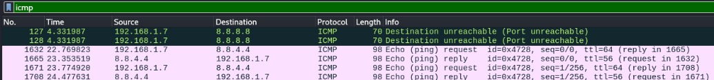](https://raw.githubusercontent.com/nicosotomayor/Wireshark-Challenge/main/Imagenes/A2.jpg)

---

## PCAP 1 – Pregunta 3  
**Respuestas DNS capturadas:** 90 paquetes  
[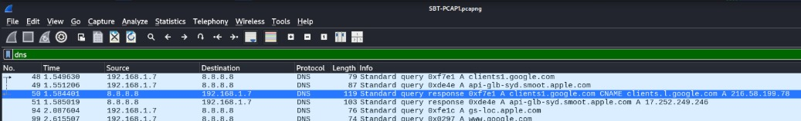](https://raw.githubusercontent.com/nicosotomayor/Wireshark-Challenge/main/Imagenes/A3.jpg)  
[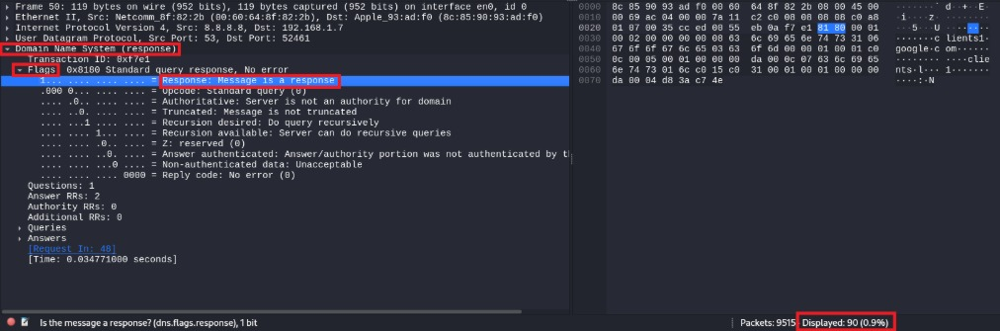](https://raw.githubusercontent.com/nicosotomayor/Wireshark-Challenge/main/Imagenes/A4.jpg)

---

## PCAP 1 – Pregunta 4  
**IP con mayor volumen de bytes:** 115.178.9.18  
[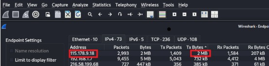](https://raw.githubusercontent.com/nicosotomayor/Wireshark-Challenge/main/Imagenes/A5.jpg)

---

## PCAP 2 – Pregunta 1  
**Contraseña de WebAdmin:** sbt123  
[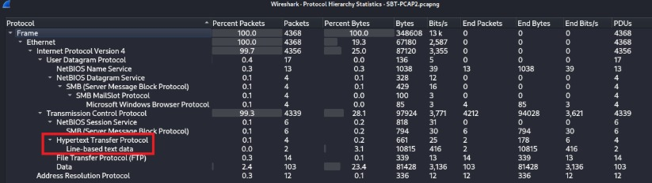](https://raw.githubusercontent.com/nicosotomayor/Wireshark-Challenge/main/Imagenes/A6.jpg)  
[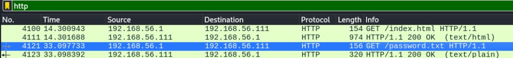](https://raw.githubusercontent.com/nicosotomayor/Wireshark-Challenge/main/Imagenes/A7.jpg)  
[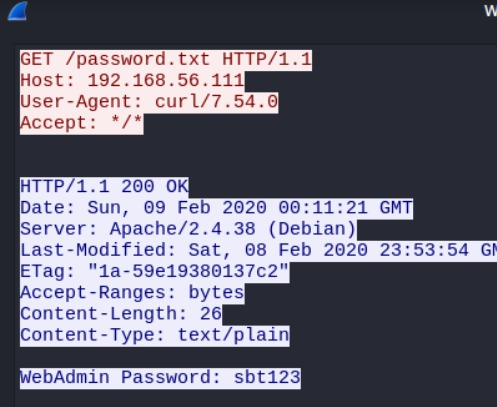](https://raw.githubusercontent.com/nicosotomayor/Wireshark-Challenge/main/Imagenes/A8.jpg)

---

## PCAP 2 – Pregunta 2  
**Versión del servidor FTP (atacante):** pyftpdlib 1.5.5  
[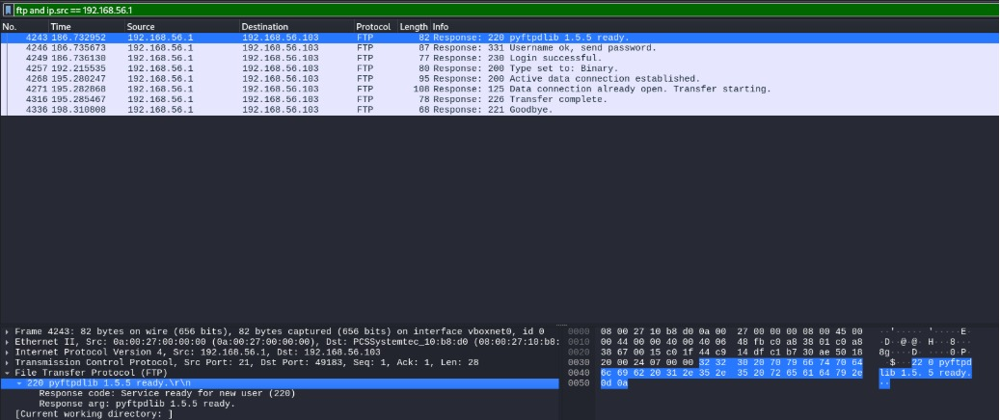](https://raw.githubusercontent.com/nicosotomayor/Wireshark-Challenge/main/Imagenes/A9.jpg)

---

## PCAP 2 – Pregunta 3  
**Puerto usado para acceder al host Win:** 8081  
[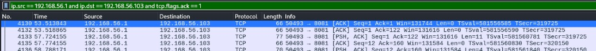](https://raw.githubusercontent.com/nicosotomayor/Wireshark-Challenge/main/Imagenes/A10.jpg)

---

## PCAP 2 – Pregunta 4  
**Archivo confidencial extraído:** Información_del_empleado_CONFIDENCIAL.txt  
[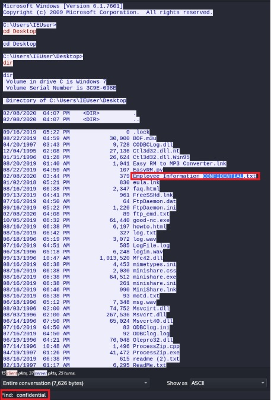](https://raw.githubusercontent.com/nicosotomayor/Wireshark-Challenge/main/Imagenes/A11.jpg)

---

## PCAP 2 – Pregunta 5  
**Archivo log creado 04:51 AM:** LogFile.log  
[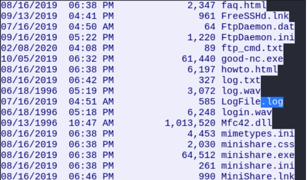](https://raw.githubusercontent.com/nicosotomayor/Wireshark-Challenge/main/Imagenes/A12.jpg)
